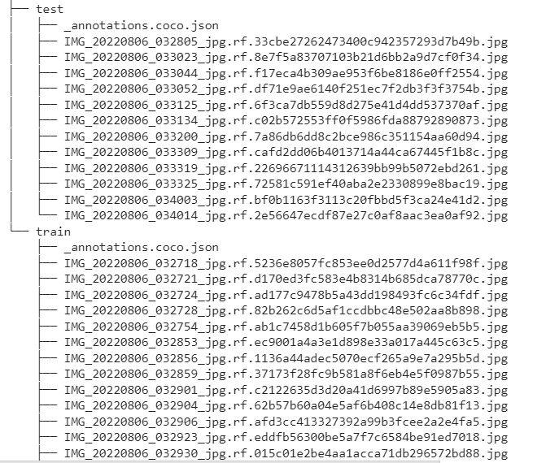

# MMDETECTION 
## 1. Giới thiệu về MMDETECTION 
[Mmdetection](https://github.com/open-mmlab/mmdetection) là **open source toolbox** thuộc [MMopenLab](https://github.com/open-mmlab).   
Mmdetection chủ yếu giải quyết 2 bài toán chính:  

- Object Detection  

  

- Instance Segmentation  

Mmdetection có tính **module cực cao**, cụ thể một model có 5 phần chính: 
- backbone: Các lớp CNN (FCN: Fully Convolution Network), để trích xuất các đặc trưng (**extract feature maps**) như: ResNet, MobileNet,...
- neck: thành phần nằm giữa backbones và head như FPN: Feature Pyramid Network, 
- head: thành phần ngõ ra, ví dụ đối với bài toán Object Detection thì ngõ ra là bbox prediction, bài toán Instance Segmentation ngõ ra là mask prediction. 
- roi extractor: ROI(region of interst) vùng trích xuất ROI feature từ feature map, như RoI Pooling, RoI Align... 
- loss: thành phần thuộc head để tính hàm loss của model, như:FocalLoss, L1Loss, ...

Mmdetection hỗ trợ cực nhiều pre-trained models, có tính cập nhật cao, kể cả với các paper gần đây. 
Khi nắm được flow của Mmdetection có thể dễ dàng hiểu được các toolbox khác của MMopenLab như MmPose, MmActions2, MmSegmentation,...
## 2. Cách cài đặt MmOpen Và MmDetection
Trên Terminal: 

    pip install mmcv-full -f https://download.openmmlab.com/mmcv/dist/cu{cuda_version}/torch{pytorch_version}/index.html  
Ví dụ: cuda: 11.3 và pytoch 1.12.0  

    pip install mmcv-full -f https://download.openmmlab.com/mmcv/dist/cu113/torch1.12.0/index.html
Lưu ý đối với Windows: cần phải có Pycocotools trước  
    
    pip install mmcv-full -f https://download.openmmlab.com/mmcv/dist/cu113/torch1.12.0/index.html 

    rm -rf mmdetection  
    git clone https://github.com/open-mmlab/mmdetection.git  
    cd mmdetection  

    pip install -e .

## 3. Cách training một model bằng MMDETECTION
Ở đây ta sẽ đi giải quyết 1 bài toán đi xác định trọng tâm của vật thể thông qua bài toán Instance Segmentation để xác định đường bao quanh (**contour**) của vật. Ta sẽ sử dụng model [Solov2](https://github.com/open-mmlab/mmdetection/tree/masterconfigs/solov2).  
Dưới đây là những đặc điểm nổi bật của model Solov2 mà tác giả đã liệt kê:  

  

Một trong những đặc điểm nổi bật của model là phát hiện rất tốt đường bao của vật thể. Điều này khá phù hợp với bài toán đã đặt ra.
## Config 
Các model của MmDetection được định nghĩa thông qua các file config.
Model solov2 có các [version](https://github.com/open-mmlab/mmdetection/tree/master/configs/solov2)  

  

Ở đây ta sẽ chọn một model cụ thể là: solov2_r50_fpn_3x_coco, chọn file config ở mục `Config` và chọn file checkpoints ở mục `Download/model`.  
Ta khởi tạo và config model như sau:  

    config = '/content/mmdetection/configs/solov2/solov2_r50_fpn_3x_coco.py'
    # Setup a checkpoint file to load
    checkpoint = 'https://download.openmmlab.com/mmdetection/v2.0/solov2/solov2_r50_fpn_3x_coco/solov2_r50_fpn_3x_coco_20220512_125856-fed092d4.pth'

    # Set the device to be used for evaluation
    device='cuda:0'

    # Load the config
    config = mmcv.Config.fromfile(config)
    # Set pretrained to be None since we do not need pretrained model here
    config.model.pretrained = None

    # Initialize the detector
    model = build_detector(config.model)

    # Load checkpoint
    checkpoint = load_checkpoint(model, checkpoint, map_location=device)

    # Set the classes of models for inference
    model.CLASSES = checkpoint['meta']['CLASSES']

    # We need to set the model's cfg for inference
    model.cfg = config

    # Convert the model to GPU
    model.to(device)
    # Convert the model into evaluation mode
    model.eval()

Nội dung của phần config bao gồm 2 phần chính là:
- load file config ([solov2_r50_fpn_3x_coco.py](https://github.com/open-mmlab/mmdetection/blob/master/configs/solov2/solov2_r50_fpn_3x_coco.py)) 
- load checkpoints (https://download.openmmlab.com/mmdetection/v2.0/solov2/solov2_r50_fpn_3x_coco/solov2_r50_fpn_3x_coco_20220512_125856-fed092d4.pth)
  
Sau đó là bước **inference**:   

    img = 'demo/demo.jpg'  
    result = inference_detector(model, img)  
    show_result_pyplot(model, img, result, score_thr=0.3)  
 ở đây thông số ngưỡng score_thr (score threshold) những đối tượng có `bbox score` nhỏ hơn ngưỡng này sẽ bị loại bỏ.  
Kết quả:   

  

Ở đây ta có thể nhận xét mask prediction của model solov2 cho đường bao khá tốt quanh vật thể.
## Load Dataset from Roboflow
Ta sẽ chọn 1 tập data đã được gán nhãn theo format của **[COCO Dataset](https://opencv.org/introduction-to-the-coco-dataset/)** (1 loại Dataset thông dụng và được MmDetection hỗ trợ.)  
Ta có thể gán nhãn dự liệu bằng [Roboflow](https://app.roboflow.com/)
Tải tập Dataset trên Roboflow như sau:  

  

        #install roboflow 
    !pip install roboflow

    from roboflow import Roboflow
    rf = Roboflow(api_key="mHpVzAdOxFdYxuwTP9U6")
    project = rf.workspace("ai-wwccr").project("mask_detect-digwa")
    dataset = project.version(20).download("coco")

Sau khi download dataset bao gồm: 

    !apt-get -q install tree
    !tree /content/mmdetection/mask_detect-20

  
ta thấy Dataset sẽ chia thành train và test trong mỗi thư mục chứ các ảnh và 1 json file annotation theo format của **COCODataset**.
## Modify the config  
Ở bước này ta sẽ chỉnh sửa lại các file Config của model cho phù hợp với Dataset của ta và các thông số trong quá trình **Training**  
Ta load file của model và sau đó chỉnh sửa như sau:

    
    from mmcv import Config
    cfg = Config.fromfile('/content/mmdetection/configs/solov2/solov2_r50_fpn_3x_coco.py')

    from mmdet.apis import set_random_seed

    # Modify dataset type and path
    cfg.dataset_type = 'COCODataset'

    cfg.data.test.ann_file = '/content/mmdetection/mask_detect-20/test/_annotations.coco.json'
    cfg.data.test.img_prefix = '/content/mmdetection/mask_detect-20/test'
    cfg.data.test.classes = ('hop',)

    cfg.data.train.ann_file = '/content/mmdetection/mask_detect-20/train/_annotations.coco.json'
    cfg.data.train.img_prefix = '/content/mmdetection/mask_detect-20/train/'
    cfg.data.train.classes = ('hop',)

    cfg.data.val.ann_file = '/content/mmdetection/mask_detect-20/test/_annotations.coco.json'
    cfg.data.val.img_prefix = '/content/mmdetection/mask_detect-20/test'
    cfg.data.val.classes = ('hop',)

    # modify num classes of the model in box head and mask head
    cfg.model.mask_head.num_classes = 1
    cfg.device = 'cuda'

    # We can still the pre-trained model to obtain a higher performance
    cfg.load_from = 'https://download.openmmlab.com/mmdetection/v2.0/solov2/solov2_r50_fpn_3x_coco/solov2_r50_fpn_3x_coco_20220512_125856-fed092d4.pth'

    # Set up working dir to save files and logs.
    cfg.work_dir = './save_file'

    # The original learning rate (LR) is set for 8-GPU training.

    cfg.optimizer.lr = 0.0003
    cfg.lr_config.warmup = None
    cfg.log_config.interval = 10

    # We can set the evaluation interval to reduce the evaluation times
    cfg.evaluation.interval = 10
    # We can set the checkpoint saving interval to reduce the storage cost
    cfg.checkpoint_config.interval = 10
    cfg.runner.max_epochs = 30
    # Set seed thus the results are more reproducible
    cfg.seed = 0
    set_random_seed(0, deterministic=False)
    cfg.gpu_ids = range(1)

    # We can also use tensorboard to log the training process
    cfg.log_config.hooks = [
        dict(type='TextLoggerHook'),
        dict(type='TensorboardLoggerHook')]

    # We can initialize the logger for training and have a look
    # at the final config used for training
    print(f'Config:\n{cfg.pretty_text}')

ta dùng [Fine-tuned](https://www.tensorflow.org/tutorials/images/transfer_learning) để đạt được kết quả tốt hơn. Khi dùng phương pháp Fine-tuned ta nên chọn learning rate nhỏ.
Sau khi chỉnh sửa ta sẽ in ra file config cụ thể của model như sau: 

  

Bắt đầu qua trình **traning**: 

    from mmdet.datasets import build_dataset
    from mmdet.models import build_detector
    from mmdet.apis import train_detector
    import os.path as osp

    # Build dataset
    datasets = [build_dataset(cfg.data.train)]

    # Build the detector
    model = build_detector(cfg.model)

    # Add an attribute for visualization convenience
    model.CLASSES = datasets[0].CLASSES

    # Create work_dir
    mmcv.mkdir_or_exist(osp.abspath(cfg.work_dir))
    train_detector(model, datasets, cfg, distributed=False, validate=True)

  

Kết quả training:  
  

Nhận xét: ta thấy kết quả training đạt được 91.8 mAP khá cao, lý do tập dataset của ta nhỏ.

Ta có thể qua sát trực quan hơn bằng: 

    # load tensorboard in colab
    %load_ext tensorboard

    # see curves in tensorboard
    %tensorboard --logdir /content/mmdetection/save_file

Sau khi training ta nên lưu lại các file trọng số của model (thường là **latest.pth**) để sử dụng lần sau:  

## Test the Trained Detector

    img = mmcv.imread('/content/mmdetection/mask_detect-20/test/IMG_20220806_033200_jpg.rf.7a86db6dd8c2bce986c351154aa60d94.jpg')

    model.cfg = cfg
    result = inference_detector(model, img)
    show_result_pyplot(model, img, result)

ta thấy mask prediction của model khá tốt. 

## Detect Center 
Tiếp theo ta sẽ dựa vào kết quả của model solov2 để xác định được tâm của vật thể. 

Ta sẽ tạo 1 class để chuyển kết quả **Mask** sang **Polygon**: 

    class GenericMask:
        """
        Attribute:
            polygons (list[ndarray]): list[ndarray]: polygons for this mask.
                Each ndarray has format [x, y, x, y, ...]
            mask (ndarray): a binary mask
        """

        def __init__(self, mask_or_polygons, height, width):
            self._mask = self._polygons = self._has_holes = None
            self.height = height
            self.width = width

            m = mask_or_polygons

            if isinstance(m, list):  # list[ndarray]
                self._polygons = [np.asarray(x).reshape(-1) for x in m]
                return

            if isinstance(m, np.ndarray):  # assumed to be a binary mask
                assert m.shape[1] != 2, m.shape
                assert m.shape == (
                    height,
                    width,
                ), f"mask shape: {m.shape}, target dims: {height}, {width}"
                self._mask = m.astype("uint8")
                return

            raise ValueError("GenericMask cannot handle object {} of type '{}'".format(m, type(m)))

        @property
        def mask(self):
            if self._mask is None:
                self._mask = self.polygons_to_mask(self._polygons)
            return self._mask

        @property
        def polygons(self):
            if self._polygons is None:
                self._polygons, self._has_holes = self.mask_to_polygons(self._mask)
            return self._polygons

        @property
        def has_holes(self):
            if self._has_holes is None:
                if self._mask is not None:
                    self._polygons, self._has_holes = self.mask_to_polygons(self._mask)
                else:
                    self._has_holes = False  # if original format is polygon, does not have holes
            return self._has_holes

        def mask_to_polygons(self, mask):
            # cv2.RETR_CCOMP flag retrieves all the contours and arranges them to a 2-level
            # hierarchy. External contours (boundary) of the object are placed in hierarchy-1.
            # Internal contours (holes) are placed in hierarchy-2.
            # cv2.CHAIN_APPROX_NONE flag gets vertices of polygons from contours.
            mask = np.ascontiguousarray(mask)  # some versions of cv2 does not support incontiguous arr
            res = cv2.findContours(mask.astype("uint8"), cv2.RETR_CCOMP, cv2.CHAIN_APPROX_NONE)
            hierarchy = res[-1]
            if hierarchy is None:  # empty mask
                return [], False
            has_holes = (hierarchy.reshape(-1, 4)[:, 3] >= 0).sum() > 0
            res = res[-2]
            res = [x.flatten() for x in res]
            # These coordinates from OpenCV are integers in range [0, W-1 or H-1].
            # We add 0.5 to turn them into real-value coordinate space. A better solution
            # would be to first +0.5 and then dilate the returned polygon by 0.5.
            res = [x + 0.5 for x in res if len(x) >= 6]
            return res, has_holes

        def area(self):
            return self.mask.sum()

Sau đó tính tạo độ của tâm: 

    def detect_center(img, result, score_thr):
        h, w = img.shape[0], img.shape[1]
        bbox_result, segm_result = result
        segms = mmcv.concat_list(segm_result)
        bboxes = np.vstack(bbox_result)
        inds = np.where(bboxes[:, -1] > score_thr)[0]
        center_list = []
        for i in inds:
            mask = GenericMask(segms[i], h, w)
            polygon = mask.polygons[0].reshape((-1, 1, 2))
            polygon = polygon.astype(np.int32)
            M = cv2.moments(polygon)
            x_center = int(M["m10"] / M["m00"])
            y_center = int(M["m01"] / M["m00"])
            center_list.append((x_center, y_center))
        return center_list

Gọi các model và detect center point: 

    import numpy as np
    import cv2
    import imutils
    from google.colab.patches import cv2_imshow
    cfg = Config.fromfile('/content/mmdetection/configs/solov2/solov2_r50_fpn_3x_coco.py')
    cfg.model.mask_head.num_classes = 1
    img = mmcv.imread('/content/mmdetection/mask_detect-20/test/IMG_20220806_033200_jpg.rf.7a86db6dd8c2bce986c351154aa60d94.jpg')
    img = imutils.resize(img, width=640)
    checkpoint = '/content/mmdetection/save_file/latest.pth'
    model = build_detector(cfg.model)
    checkpoint = load_checkpoint(model, checkpoint, map_location='cpu')
    model.CLASSES = checkpoint['meta']['CLASSES']
    model.cfg = cfg
    model.to('cuda')
    model.eval()
    score_thr = 0.8
    result = inference_detector(model, img)
    img_show = model.show_result(img,
                                result,
                                score_thr=score_thr,
                                show=False,
                                wait_time=0,
                                win_name='result',
                                bbox_color=None,
                                text_color=(200, 200, 200),
                                mask_color=None,
                                out_file=None)
            
    center_list = detect_center(img, result, score_thr)
    for center in center_list:
        img_show = cv2.circle(img_show, center, 3, (0,0,255), -1)   
 
kết quả:  
  

Vậy là ta đã xác định được trọng tâm của vật thể thông qua bài toán Instance Segmentation. 
